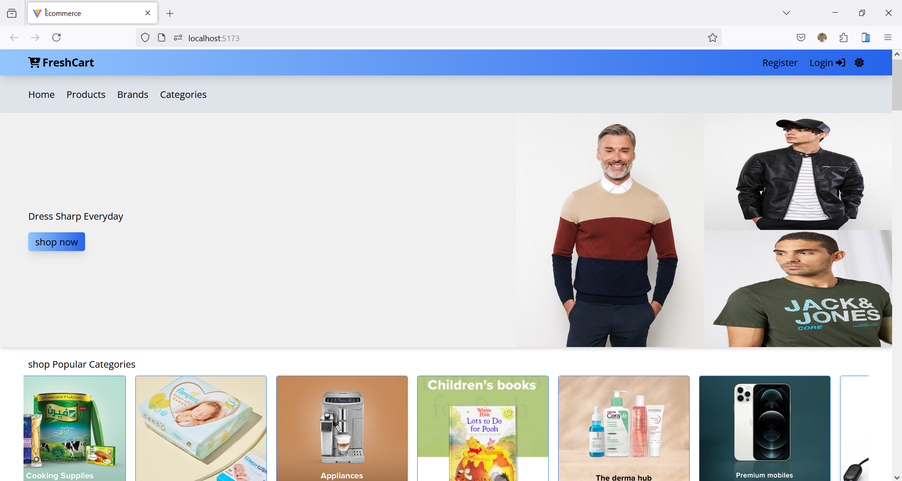
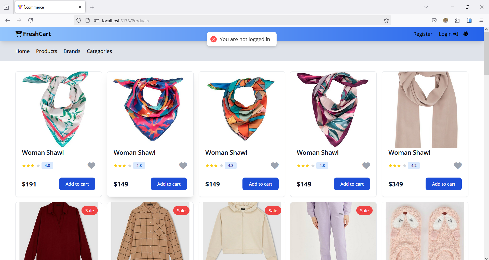
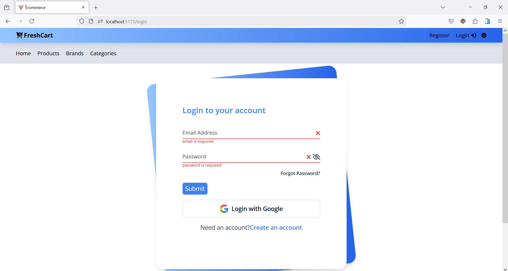
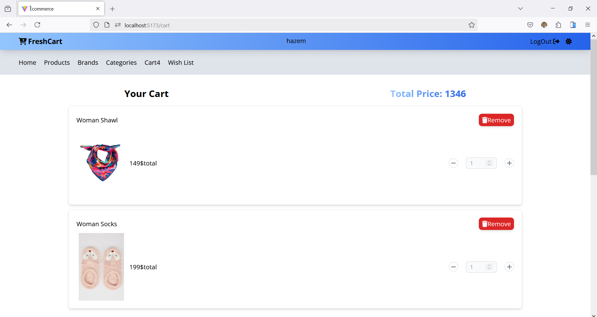
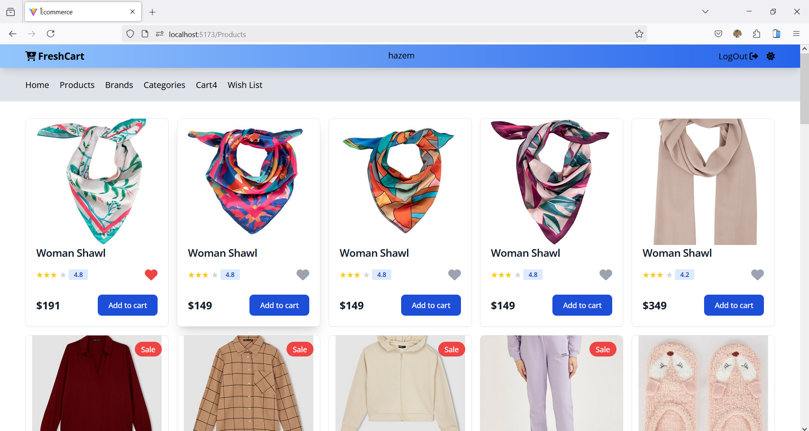
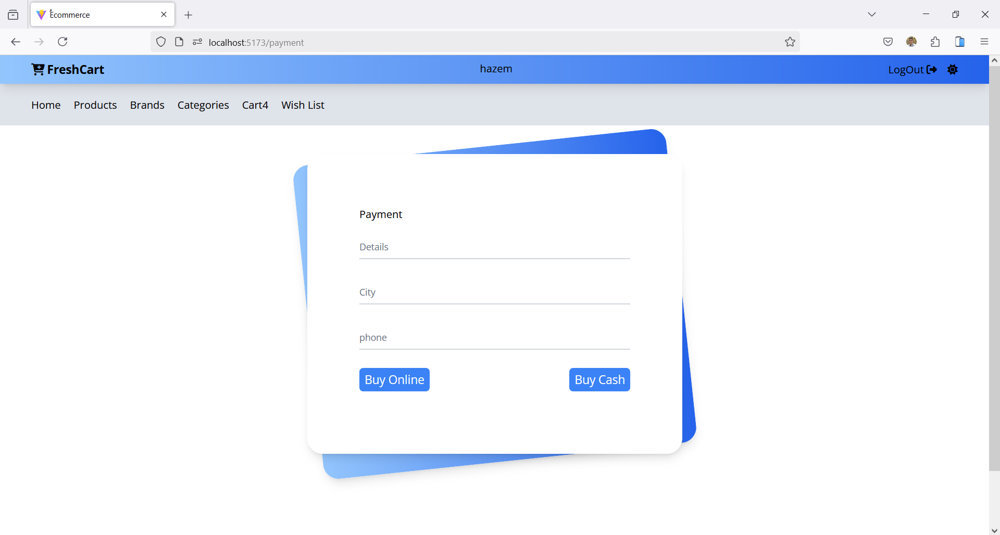

# Ecommerce Project

This project is an Ecommerce application that allows users to browse products, add them to the cart, and complete purchases easily. The project focuses on a smooth user experience and high performance.
# [live demo](https://recipe-pi-seven.vercel.app/).








## Features

- User registration and login
- Product details page
- Add products to the cart and manage them
- Browse products by categories
- Search for products
- Checkout process

## Technologies Used

- [React](https://reactjs.org/)
- [React Router](https://reactrouter.com/)
- [Axios](https://axios-http.com/)
- [Sass](https://sass-lang.com/)
- [Aos](https://michalsnik.github.io/aos/)
- [Tailwind CSS](https://tailwindcss.com/)

## How to Run

1. Download or clone the project:

   ```bash
   git clone https://github.com/your-username/your-repo-name.git

## Project Structure
1. src/components/: Contains React components like Home, Products, and Details.
2. src/context/: Contains ContextAPIProvider.jsx, which manages the app state and fetches data from the API.
3. src/assets/: Contains images and other assets used in the app.
4. src/App.js: The main file that handles routing between pages.
5. src/index.js: The entry point of the application.

## Dependencies
   1. axios: For fetching data from the API.
   2. sass: For styling the UI.
   3. react-slick: For make slider.
   4. AOS animations: For animation.
   5. Vite + react: For building the user interface.
   6. react-router-dom: For managing routing between pages.
   6. Tailwind CSS: For fast and efficient styling